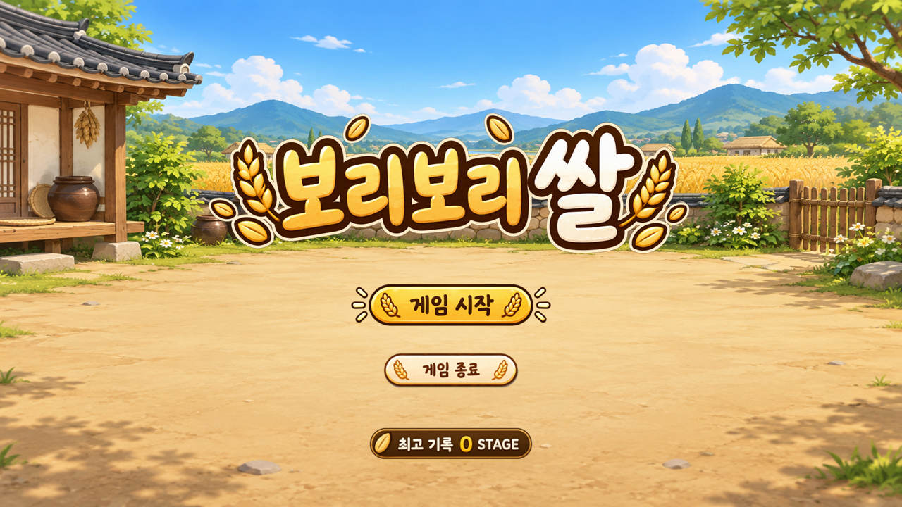
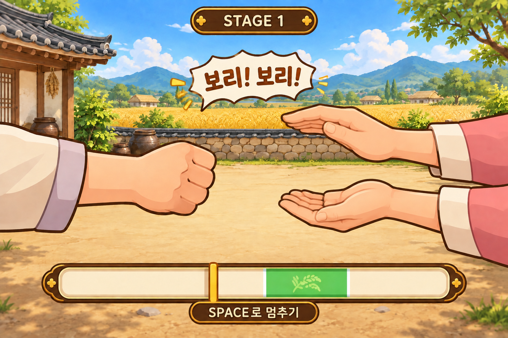
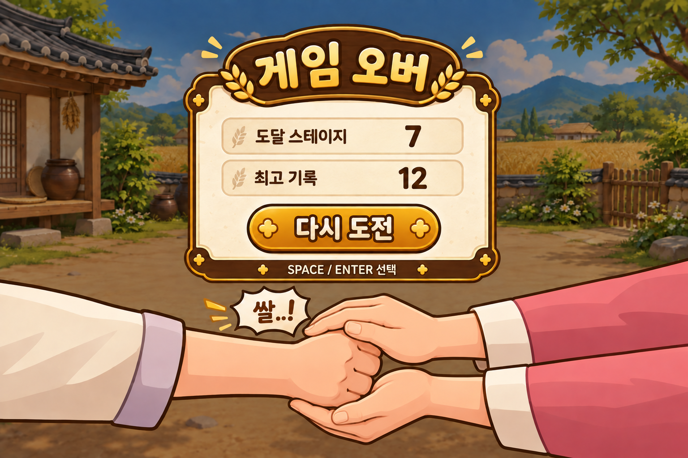

# 게임 기획서 — 보리보리쌀

*타이틀 화면 예시 — 게임 시작, 종료, 최고 기록을 한눈에 확인할 수 있다.*

## 게임 기본 콘셉트

| 항목 | 내용 |
| --- | --- |
| 장르 | 순발력 중심의 QTE 캐주얼 게임 |
| 모티브 | 전통 손놀이 ‘보리보리쌀’ |
| 핵심 목표 | 움직이는 타이밍 바를 정확한 순간에 멈춰 상대 AI에게 주먹이 잡히지 않고 최대한 많은 스테이지를 돌파한다. |
| 조작 | 스페이스바 하나 |
| 진행 방식 | 무한 스테이지 |

## 한 스테이지의 진행

1. 게임 화면에 **“보리!”**가 표시된다.
2. 다시 한번 **“보리!”**가 표시된다.
3. 화면 아래에 타이밍 바(QTE)가 등장한다.
4. 플레이어가 스페이스바를 눌러 움직이는 타이밍 표시를 멈춘다.
5. 멈춘 위치에 따라 성공과 실패가 결정된다.

*플레이 화면 예시 — 구호와 손동작을 확인하며 하단 타이밍 바를 스페이스바로 멈춘다.*

### 성공

- 타이밍 표시가 초록색 클리어 구간 안에서 멈춘다.
- 캐릭터가 힘차게 **“쌀!”**이라고 외친다.
- 플레이어의 주먹이 상대 AI의 손 사이로 빠르게 들어갔다가 빠져나온다.
- AI가 주먹을 잡는 데 실패한다.
- **CLEAR!** 문구가 나타난 뒤 다음 스테이지로 넘어간다.

### 실패

- 타이밍 표시가 클리어 구간을 벗어난다.
- 캐릭터가 자신 없는 느낌으로 **“쌀..!”**이라고 외친다.
- 상대 AI의 두 손이 닫히며 플레이어의 주먹을 잡는다.
- 게임 오버 화면에 도달 스테이지와 최고 기록을 표시한다.

*게임 오버 화면 예시 — 도달 스테이지와 최고 기록을 보여 주고 재도전을 안내한다.*

## 난이도 구조

스테이지는 제한 없이 계속 이어진다. 스테이지가 높아질수록 타이밍 표시의 이동 속도가 빨라져 정확한 순간에 스페이스바를 누르기 어려워진다. 속도는 플레이 불가능할 정도로 높아지지 않도록 상한을 둔다.

이 게임의 핵심 재미는 다음 세 가지다.

- 점점 빨라지는 속도에서 오는 긴장감
- 성공 직후 주먹을 재빨리 빼는 시각적 쾌감
- 최고 스테이지 기록을 갱신하는 도전 욕구

## 화면 구성과 조작

- 상단: 현재 스테이지와 이번 실행 중의 최고 기록
- 중앙: AI의 양손, 플레이어의 주먹, “보리/쌀” 구호와 결과 문구
- 하단: 왕복하는 타이밍 표시와 초록색 클리어 구간
- `Space`: 시작, 타이밍 정지, 게임 오버 후 재도전
- `Esc`: 게임 종료
- `Alt + Enter`: 전체화면 전환
