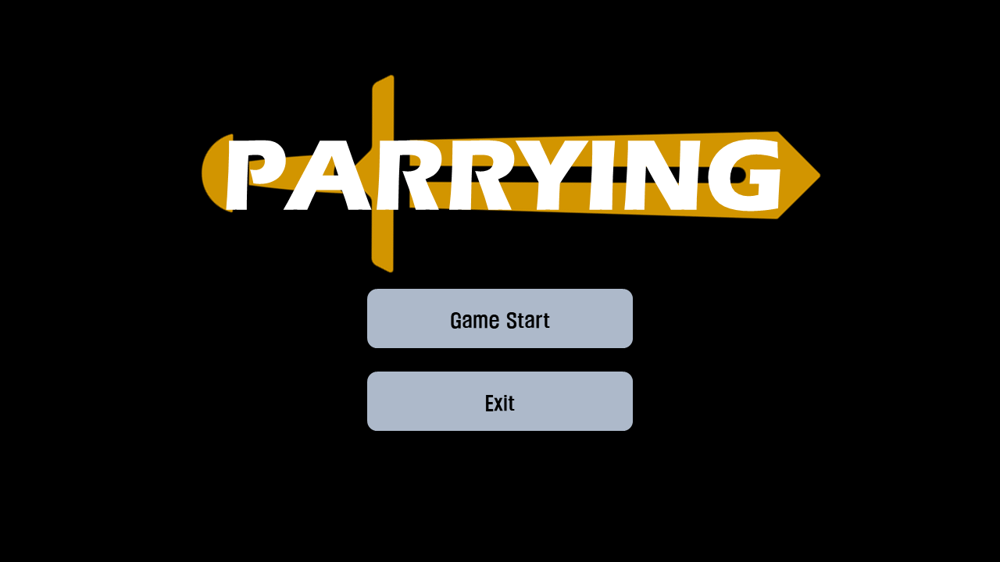
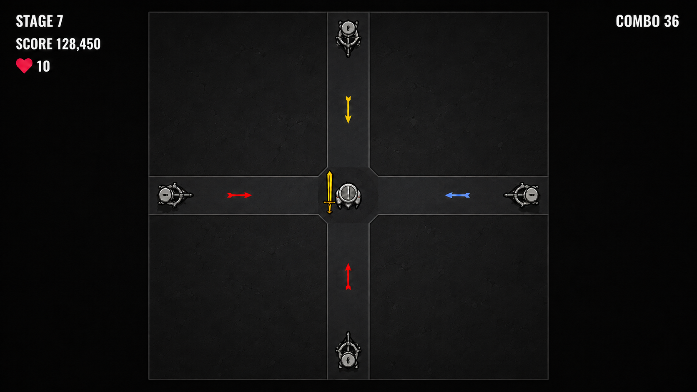
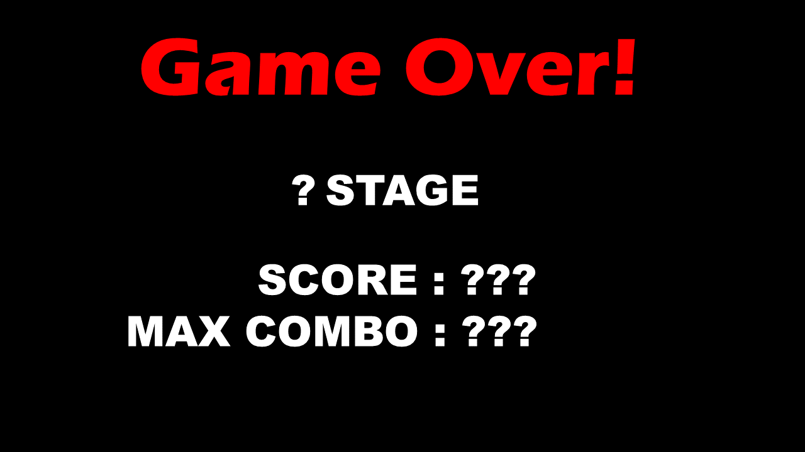

# 게임 기획서 — PARRYING (패링)

## 1. 게임 개요

| 항목 | 내용 |
| --- | --- |
| 장르 | 2D 패링 액션 / 무한 스코어 어택 |
| 플레이 방식 | 싱글 플레이 |
| 조작 | 키보드 방향키 ↑ ↓ ← → |
| 목표 | 사방에서 날아오는 화살을 상대하며 높은 스테이지와 최고 점수에 도전한다. |

플레이어는 화면 중앙에 고정되어 화살의 **방향·색상·도달 타이밍**을 판단한다. 파란색 화살을 쳐내 콤보와 점수를 이어갈지, 맞아서 체력을 회복할지 선택하는 것이 핵심이다.

## 2. 화면 구성

### 시작 화면

게임 로고와 **Game Start**, **Exit** 버튼을 표시한다.

### 플레이 화면

중앙에 플레이어를 배치하고 동·서·남·북에서 화살이 접근한다. 화면에는 **현재 스테이지, 누적 점수, HP, 현재 콤보**를 표시한다.

※ 이미지는 화면 구성 예시이며, 표시된 수치는 확정된 밸런스 값이 아니다.

## 3. 조작과 패링

화살이 패링 범위에 들어왔을 때 **화살이 날아오는 방향**의 방향키를 누르면 화살을 쳐낸다. 별도의 이동 조작은 없다.

| 화살이 오는 방향 | 입력 |
| --- | --- |
| 위 / 북쪽 | ↑ |
| 아래 / 남쪽 | ↓ |
| 왼쪽 / 서쪽 | ← |
| 오른쪽 / 동쪽 | → |

패링에 성공하면 화살이 제거된다. 패링하지 못해 화살이 플레이어에게 닿으면 색상에 따른 피격 효과가 발생한다.

## 4. 화살과 체력

| 종류 | 패링 성공 | 피격 |
| --- | --- | --- |
| 🔴 빨간색 | 화살 제거, 점수 획득, 콤보 증가 | HP 1 감소, 콤보 초기화 |
| 🔵 파란색 | 회복 없이 화살 제거, 점수 획득, 콤보 증가 | HP 회복, 콤보 초기화 |
| 🟡 노란색 | 점수 획득, 콤보 증가, 스테이지 클리어 | 현재 HP와 관계없이 즉시 게임 오버 |

초기 HP는 **10을 기준으로 테스트**한다. 초기·최대 HP와 파란색 화살의 회복량은 플레이 테스트를 통해 확정한다. HP가 0이 되면 게임 오버된다.

## 5. 스테이지와 진행 방식

**게임 시작 → 화살 1~99개 대응 → 100번째 노란색 화살 패링 → 다음 스테이지** 순서로 진행한다. 최종 스테이지 없이 게임 오버될 때까지 반복한다.

| 등장 순서 | 화살 구성 |
| --- | --- |
| 1~99번째 | 각 화살이 빨간색 80%, 파란색 20% 확률로 등장 |
| 100번째 | 노란색 화살이 반드시 등장 |

화살이 오는 방향은 네 방향 중 무작위로 결정된다. 스테이지가 올라갈수록 **화살의 이동 속도와 패링으로 얻는 기본 점수**가 증가한다. 마지막 노란색 화살은 한 번의 실패로 게임이 끝나므로 스테이지 후반의 긴장감을 높인다.

## 6. 점수와 콤보

### 점수

- 화살을 패링하면 점수를 얻으며, 점수는 게임이 끝날 때까지 누적된다.
- 높은 스테이지일수록 패링 1회당 얻는 기본 점수가 커진다.
- 연속 패링으로 콤보를 이어가면 기본 점수에 **콤보 추가 점수**를 더한다.
- 기본 점수, 스테이지별 증가량, 콤보 추가 점수의 계산 방식은 추후 확정한다.

점수 구조는 **패링 획득 점수 = 현재 스테이지의 기본 점수 + 콤보 추가 점수**로 정리한다. 구체적인 수치는 플레이 테스트를 통해 조정한다.

### 콤보

화살의 색상과 관계없이 연속으로 패링하면 콤보가 쌓인다. 패링 1회 성공 시 콤보가 1 증가하며, 화살에 맞으면 현재 콤보가 0으로 초기화된다. 콤보가 끊겨도 이미 획득한 점수는 유지된다.

특히 **파란색 화살은 맞으면 체력을 회복하지만 콤보가 끊긴다.** 따라서 체력이 부족할 때는 회복을, 고득점을 노릴 때는 패링을 선택하게 된다. 최대 콤보는 한 게임에서 달성한 가장 높은 연속 패링 횟수로 기록한다.

## 7. 게임 오버와 결과 화면

**HP가 0이 되거나 노란색 화살에 맞으면** 게임이 종료된다. 결과 화면에는 다음 기록을 표시한다.

- 최종 도달 스테이지
- 최종 누적 점수
- 최대 콤보

플레이어가 이전 기록을 기준으로 생존과 고득점에 다시 도전하도록 한다.

## 8. 추후 확정 항목

| 항목 | 조정 또는 결정할 내용 |
| --- | --- |
| 패링 판정 | 패링 범위와 입력 허용 시간 |
| 난이도 | 화살 기본 속도, 스테이지별 속도 증가량, 등장 간격 |
| 체력 | 초기·최대 HP, 파란색 화살의 회복량 |
| 점수 | 기본 점수, 스테이지별 증가량, 콤보 보너스 적용 시작점과 계산 방식 |
| 콤보 세부 규칙 | 스테이지 전환 시 유지 여부, 화살 피격 없이 잘못 입력했을 때의 처리 |