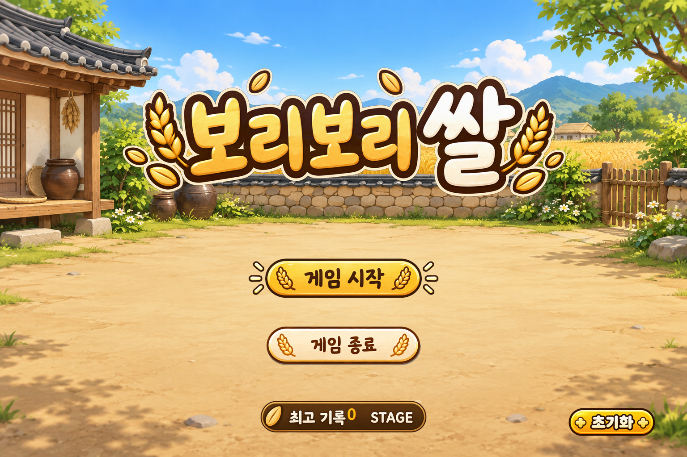
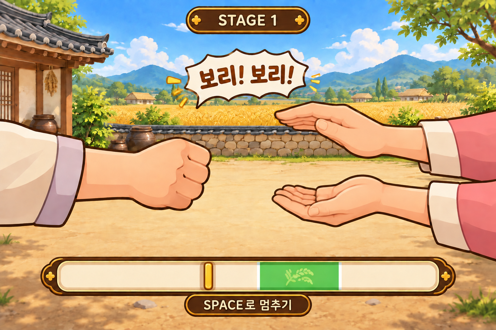
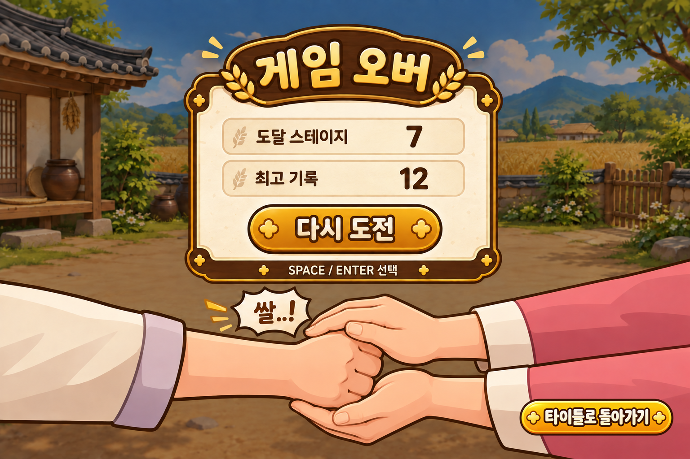

# 게임 기획서 — 보리보리쌀

*타이틀 화면 — 게임 시작, 게임 종료, 최고 기록 확인과 기록 초기화를 할 수 있다.*

## 게임 개요

| 항목 | 내용 |
| --- | --- |
| 장르 | 순발력 중심의 QTE 캐주얼 게임 |
| 모티브 | 전통 손놀이 ‘보리보리쌀’ |
| 목표 | 움직이는 타이밍 표시를 초록색 구간에서 멈춰 최대한 높은 스테이지에 도달한다. |
| 주요 조작 | 키보드 `Space`와 마우스 클릭 |
| 진행 방식 | 제한 없이 이어지는 무한 스테이지 |
| 기록 | 가장 높게 클리어한 스테이지를 저장하고 다음 실행에서도 유지 |

## 전체 게임 흐름

1. 타이틀 화면에서 **게임 시작** 버튼을 클릭하거나 `Space`를 누른다.
2. 게임 화면으로 전환되면서 **“보리! 보리!”** 이미지가 바로 나타난다.
3. 준비 연출이 끝나면 타이밍 표시가 하단의 타이밍 바를 좌우로 움직인다.
4. 플레이어가 `Space`를 눌러 현재 위치를 판정한다.
5. 초록색 구간 안에서 멈추면 성공하고 다음 스테이지로 진행한다.
6. 초록색 구간 밖에서 멈추면 실패하고 게임오버 화면으로 이동한다.

*플레이 화면 — 현재 스테이지, “보리! 보리!” 구호, 타이밍 표시와 초록색 성공 구간을 확인할 수 있다.*

## 핵심 게임 규칙

### 타이밍 바

- 노란색 타이밍 표시가 바 안을 좌우로 왕복한다.
- 플레이어는 `Space`를 눌러 타이밍을 판정한다.
- 화면에 표시된 초록색 영역이 성공 구간이다.
- 성공 구간은 스테이지마다 타이밍 바 안의 무작위 위치로 변경된다.
- 이전 스테이지와 너무 비슷한 위치가 반복되지 않도록 위치를 다시 선택한다.
- 표시되는 초록색 영역과 실제 성공 판정 범위는 동일하다.

### 성공

- 타이밍 표시가 초록색 구간 안에 있으면 성공한다.
- 화면 중앙에 **“쌀!”** 이미지가 팝 효과와 함께 나타난다.
- 성공 효과음이 재생된다.
- 현재 스테이지가 최고 기록보다 높으면 기록을 갱신한다.
- 성공 연출이 끝나면 스테이지가 1 증가하고 다음 판이 시작된다.

### 실패

- 타이밍 표시가 초록색 구간 밖에 있으면 실패한다.
- 플레이 BGM이 정지하고 게임오버 효과음이 재생된다.
- 게임오버 화면에 도달 스테이지와 최고 기록이 표시된다.

*게임오버 화면 — 도달 스테이지와 최고 기록을 확인하고 다시 도전하거나 타이틀로 돌아갈 수 있다.*

## 난이도 구조

스테이지가 올라갈수록 타이밍 표시의 이동 속도가 증가한다. 속도에 최종 제한은 없으며, 게임을 오래 진행할수록 계속 어려워진다.

| 스테이지 | 속도 변화 |
| --- | --- |
| 1스테이지 | 기본 속도 250 |
| 2~12스테이지 | 스테이지마다 55씩 증가 |
| 13스테이지 | 속도 900 도달 |
| 14스테이지 이후 | 스테이지마다 20씩 계속 증가 |

초반에는 속도가 빠르게 증가해 난도가 확실하게 변한다. 후반에는 증가 폭을 낮춰 게임을 계속 진행할 수 있으면서도 긴장감은 유지되도록 구성했다.

## 화면별 기능

### 타이틀 화면

- **게임 시작**: 1스테이지부터 게임을 시작한다.
- **게임 종료**: 게임을 종료한다.
- **최고 기록**: 저장된 최고 클리어 스테이지를 표시한다.
- **초기화**: 저장된 최고 스테이지를 0으로 변경한다.
- 타이틀 전용 BGM이 반복 재생된다.

### 플레이 화면

- 상단에 현재 스테이지를 표시한다.
- 중앙에 캐릭터의 손과 **“보리! 보리!”**, 성공 시 **“쌀!”** 이미지를 표시한다.
- 하단에 타이밍 바, 성공 구간과 움직이는 타이밍 표시를 배치한다.
- 플레이 전용 BGM이 반복 재생된다.

### 게임오버 화면

- 도달 스테이지와 최고 클리어 기록을 표시한다.
- **다시 도전** 버튼을 누르면 1스테이지부터 다시 시작한다.
- **타이틀로 돌아가기** 버튼을 누르면 타이틀 화면으로 이동한다.

## 버튼 기능

- 게임 시작, 게임 종료, 초기화, 다시 도전, 타이틀로 돌아가기 버튼을 마우스로 선택할 수 있다.
- 버튼을 클릭하면 버튼이 커졌다가 원래 크기로 돌아오는 시각 효과가 나타난다.
- 모든 버튼에서 공통 클릭 효과음이 재생된다.
- 키보드 조작도 함께 지원한다.

## 사운드 구성

| 상황 | 사운드 |
| --- | --- |
| 타이틀 화면 | 타이틀 BGM 반복 재생 |
| 게임 시작 및 다시 도전 | 플레이 BGM 반복 재생 |
| 타이밍 성공 | 성공 효과음 재생 |
| 게임오버 | 플레이 BGM 정지 후 게임오버 효과음 재생 |
| 타이틀 복귀 | 타이틀 BGM 다시 재생 |
| 버튼 클릭 | 공통 버튼 클릭 효과음 재생 |

## 조작 방법

| 입력 | 기능 |
| --- | --- |
| `Space` | 게임 시작, 타이밍 판정, 게임오버 후 재도전 |
| `Enter` | 게임오버 화면에서 재도전 |
| 마우스 왼쪽 클릭 | 화면에 표시된 버튼 선택 |
| `Esc` | 게임 종료 |
| `Alt + Enter` | 창 모드와 전체화면 모드 전환 |

## 기록 저장

- 플레이 중 성공해서 클리어한 가장 높은 스테이지를 최고 기록으로 저장한다.
- 실패한 현재 스테이지는 최고 기록에 포함하지 않는다.
- 게임을 종료하고 다시 실행해도 최고 기록이 유지된다.
- 타이틀 화면의 **초기화** 버튼을 누르면 최고 기록이 0으로 변경된다.
- 기록 저장에 문제가 발생하더라도 게임 플레이는 계속할 수 있다.

## 핵심 재미

- 스테이지마다 달라지는 성공 구간에 적응하는 재미
- 계속 빨라지는 타이밍 표시에서 오는 긴장감
- 성공 순간 나타나는 “쌀!” 이미지와 효과음의 피드백
- 최고 스테이지 기록을 갱신하기 위한 반복 도전
